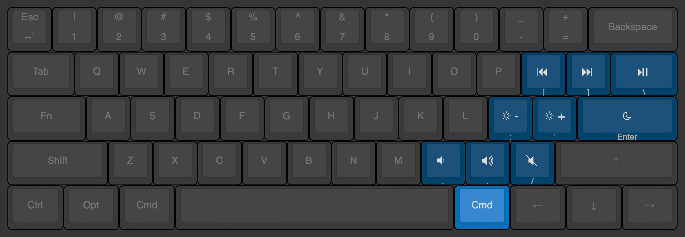

# Intentio
_Config files for a shortcut system based on Karabiner (via Goku), Yabai, and Übersicht (via Nero.)_

Intentio is a layer-based shortcut system for macOS that leverages Karabiner to launch applications quickly, control Yabai tiling window manager, and standardize some media keys. In addition, Yabai's state is monitored with Nero, an Übersicht widget.

## Table of contents

- [Requirements](#requirements)
- [Installation](#installation)
- [Components](#components)
- [Layers](#layers)
  - [Windows layer](#windows-layer)
  - [Spaces layer](#spaces-layer)
  - [Media layer](#media-layer)
  - [Launch layer](#launch-layer)
- [Monitoring](#monitoring)
- [License](#license)
- [Contacts](#contacts)

## Requirements

- [Goku](https://github.com/yqrashawn/GokuRakuJoudo): EDN → JSON translator for Karabiner
- [Karabiner](https://karabiner-elements.pqrs.org): keyboard customizer
- [Yabai](https://github.com/koekeishiya/yabai): tiling window manager
- [Übersicht](https://tracesof.net/uebersicht/): desktop widgets
- [Nero](https://github.com/lucaorio/nero): Übersicht widget to monitor the state of Yabai

Familiarizing with each project before diving deep into the configuration files is encouraged.

## Installation

Intentio is a highly customized configuration that doesn't have to be fully embraced: cloning the repo and symlinking all current files to the `.config` folder is not advised, as you'd have to stick to my workflow.

Just pick the parts you find relevant, copy/paste particular snippets, or adapt the logic of this project to your own needs!

## Components

Intentio offers:
- A `karabiner.edn` (translated to a `karabiner.json` via Goku) that simplify the creation of rules for Karabiner
- A `yabairc` config file for Yabai
- A collection of shell scripts (`shscripts` folder) to handle complex actions for Yabai, and the refresh of Nero

## Layers

Rather than relying on complex shortcuts and polluting modifiers' actions, Intentio leverages the concept of layers to separate concerns as much as possible. Layers are defined in Goku's EDN file and activated by pressing a trigger key.

> All images below have been created with [Keyboard Layout Editor](http://www.keyboard-layout-editor.com).

### Windows layer
The windows layer focuses on triggering Yabai window-related commands and, in a few cases, some custom shell scripts.

| Trigger | Hotkey                | Action                                             | Target                |
|---------|-----------------------|----------------------------------------------------|-----------------------|
| `z`     | `1` `2` .. `0`        | Move window to space (n)                           | Yabai                 |
| `z`     | `hyphen`              | Move window to new space (without focus)           | Yabai                 |
| `z`     | `equal_sign`          | Move window to new space (with focus)              | Yabai                 |
| `z`     | `delete_or_backspace` | Toggle window tiling (float/tiled)                 | Yabai                 |
| `z`     | `w` `a` `s` `d`       | Swap window position (north/west/south/east)       | Yabai                 |
| `z`     | `t` `f` `g` `h`       | Warp window insertion (north/west/south/east)      | Yabai                 |
| `z`     | `i` `j` `k` `l`       | Resize window region (north/west/south/east)       | Yabai                 |
| `z`     | `p`                   | Float and resize window to center/rectangular      | resize-center-mini.sh |
| `z`     | `open_bracket`        | Float and resize window to left/column             | resize-left-col.sh    |
| `z`     | `close_bracket`       | Float and resize window to right/column            | resize-right-col.sh   |
| `z`     | `backslash`           | Float and resize window to fullscreen (non-native) | resize-fullscreen.sh  |
| `z`     | `return_or_enter`     | Re-focus most recent active window                 | Yabai                 |
| `z`     | `slash`               | Toggle float + sticky + topmost mode               | toggle-sticky.sh      |
| `z`     | `up_arrow`            | Focus window (north)                               | Yabai                 |
| `z`     | `down_arrow`          | Focus window (south)                               | Yabai                 |
| `z`     | `left_arrow`          | Focus window (west)                                | Yabai                 |
| `z`     | `right_arrow`         | Focus window (east)                                | Yabai                 |
| `z`     | `spacebar`            | Flash focused window                               | flash-focused.sh      |

### Spaces layer
The spaces layer focuses on triggering Yabai space-related commands and, in a few cases, some custom shell scripts.

| Trigger | Hotkey                | Action                               | Target               |
|---------|-----------------------|--------------------------------------|----------------------|
| `x`     | `1` `2` .. `0`        | Focus space (n)                      | Yabai                |
| `x`     | `hyphen`              | Create new space                     | Yabai                |
| `x`     | `equal_sign`          | Destroy current space                | focus-and-destroy.sh |
| `x`     | `delete_or_backspace` | Change space layout (floating - flt) | Yabai                |
| `x`     | `backslash`           | Change space layout (tiled - bsp)    | Yabai                |
| `x`     | `open_bracket`        | Move space (left)                    | Yabai                |
| `x`     | `close_bracket`       | Move space (right)                   | Yabai                |
| `x`     | `return_or_enter`     | Re-focus most recent active space    | Yabai                |
| `x`     | `m`                   | Rotate space layout (90deg)          | Yabai                |
| `x`     | `comma`               | Flip space layout (horizontal)       | Yabai                |
| `x`     | `period`              | Flip space layout (vertical)         | Yabai                |
| `x`     | `slash`               | Re-balance space layout              | Yabai                |
| `x`     | `left_arrow`          | Focus space (previous)               | Yabai                |
| `x`     | `right_arrow`         | Focus space (next)                   | Yabai                |
| `x`     | `up_arrow`            | Trigger Mission Control              | Yabai                |
| `x`     | `down_arrow`          | Trigger Show Desktop                 | Yabai                |

### Media layer
The media layer controls brightness, audio, and Do Not Disturb mode. The value of this is keeping the shortcuts consistent across input types, as different brands of mechanical keyboards handle those controls differently than others.

| Trigger | Hotkey            | Action                                    | Target                      |
|---------|-------------------|-------------------------------------------|-----------------------------|
| `cmd`   | `open_bracket`    | Previous media track                      | macOS (via custom shortcut) |
| `cmd`   | `close_bracket`   | Next media track                          | macOS (via custom shortcut) |
| `cmd`   | `backslash`       | Play/pause current track                  | macOS (via custom shortcut) |
| `cmd`   | `semicolon`       | Decrease brightness (in small increments) | macOS (via custom shortcut) |
| `cmd`   | `quote`           | Increase brightness (in small increments) | macOS (via custom shortcut) |
| `cmd`   | `return_or_enter` | Toggle Do Not Disturb mode                | macOS (via custom shortcut) |
| `cmd`   | `comma`           | Decrease volume (in small increments)     | macOS (via custom shortcut) |
| `cmd`   | `period`          | Increase volume (in small increments)     | macOS (via custom shortcut) |
| `cmd`   | `slash`           | Mute volume                               | macOS (via custom shortcut) |

> Note: the `cmd` trigger is labeled as such not to confuse things. In reality, `cmd` (`right_alt` on Pok3r or `right_gui` on Keychron) invokes a `hyper` key.
> Make sure to remap the key close to the right side of `spacebar` int the keyboard profile at the top of Goku config.

### Launch layer
The launch layer bypasses tools such as Raycast or Alfred to accelerate the opening of applications used very frequently.

| Trigger | Hotkey     | Action           | Target                |
|---------|------------|------------------|-----------------------|
| `slash` | `a`        | "Apple" Music    | macOS (via "open -a") |
| `slash` | `b`        | "Browser" Safari | macOS (via "open -a") |
| `slash` | `c`        | Code             | macOS (via "open -a") |
| `slash` | `f`        | Figma            | macOS (via "open -a") |
| `slash` | `i`        | iTerm            | macOS (via "open -a") |
| `slash` | `m`        | Mail             | macOS (via "open -a") |
| `slash` | `o`        | Obsidian         | macOS (via "open -a") |
| `slash` | `s`        | Slack            | macOS (via "open -a") |
| `slash` | `t`        | Things           | macOS (via "open -a") |
| `slash` | `comma`    | macOS Settings   | macOS (via "open -a") |
| `slash` | `spacebar` | Finder           | macOS (via "open -a") |

## Monitoring

Intentio leverages [Nero](https://github.com/lucaorio/nero), a Übersicht widget to monitor the state of Yabai tiling window manager.

Nero do not refresh periodically to preserve battery life and stay as reactive as possible; the updating of the widget is triggered by Karabiner or Yabai itself by listening to specific events (or *signals*).

As an overview:
- Space and window focus: *Yabai → Shell script → Nero*
- Window creation: *Yabai → Shell script → Nero*
- Space and space layout manipulation: *Karabiner → Shell script → Nero*
- Window tiling: *Karabiner → Shell script → Nero*

For a more granular understanding of the events triggering a refresh, search for `refresh-uebersicht.sh` in the `yabairc` or `karabiner.kdn` files.

## License

## Contacts

- Mastodon: [@lucaorio](http://mastodon.design/@lucaorio)
- Website: [lucaorio.com](http://lucaorio.com)
