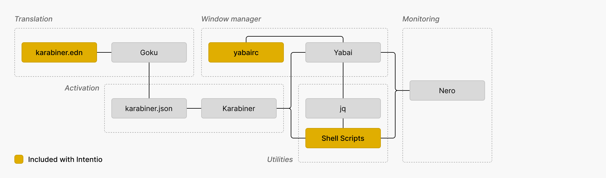
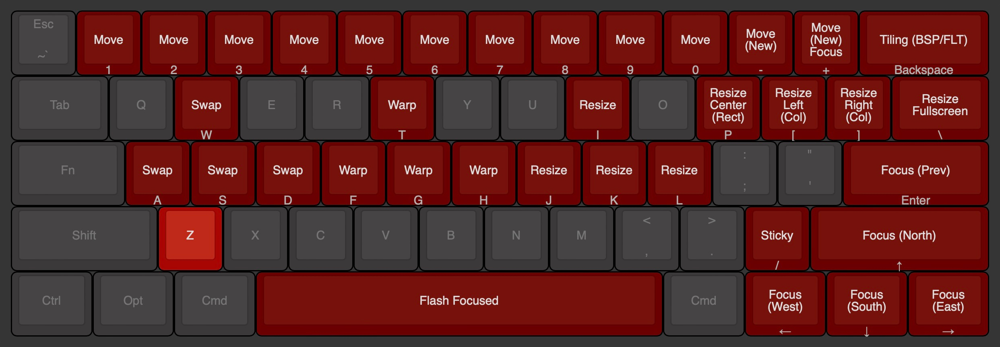
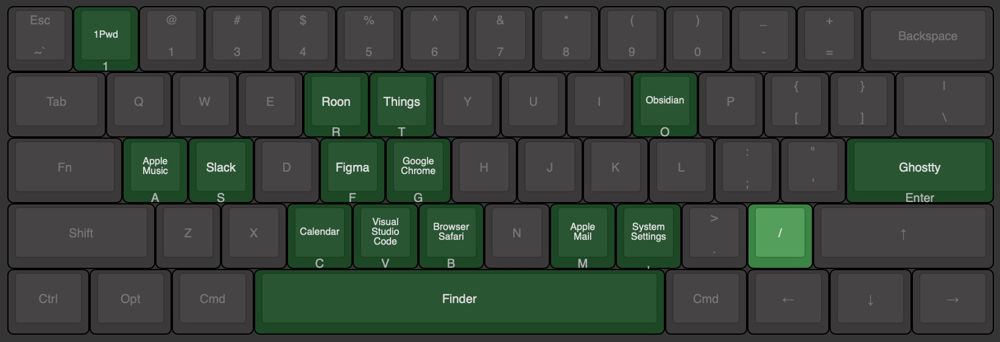

# Intentio
_Config files for a shortcut system based on Karabiner (via Goku), Yabai, and Übersicht (via Nero.)_

Intentio is a layer-based shortcut system for macOS that leverages Karabiner to launch applications quickly, control Yabai tiling window manager, and standardize some media keys. In addition, Yabai's state is monitored with Nero, an Übersicht widget.

## Table of contents

- [Requirements](#requirements)
- [Installation](#installation)
- [Components](#components)
- [Layers](#layers)
  - [Windows layer](#windows-layer)
  - [Spaces layer](#spaces-layer)
  - [Utility layer](#utility-layer)
  - [Launch layer](#launch-layer)
- [Monitoring](#monitoring)
- [License](#license)
- [Contacts](#contacts)

## Requirements

- [Goku](https://github.com/yqrashawn/GokuRakuJoudo): EDN → JSON translator for Karabiner
- [Karabiner](https://karabiner-elements.pqrs.org): Keyboard customizer
- [Yabai](https://github.com/koekeishiya/yabai): Tiling window manager
- [jq](https://github.com/jqlang/jq): Command-line JSON processor
- [Übersicht](https://tracesof.net/uebersicht/): Desktop widgets
- [Nero](https://github.com/lucaorio/nero): Übersicht widget to monitor the state of Yabai

Familiarizing with each project before diving deep into the configuration files is encouraged.

## Installation

Intentio is a highly customized configuration that you don't need to fully adopt. Cloning the repository and symlinking all current files to the `.config` folder is not advisable, as it requires you to adhere to my workflow.

Instead, choose the parts that are relevant to you. Feel free to copy and paste specific snippets or adapt the project's logic to suit your own needs!

## Components

Intentio is composed of:
- A `karabiner.edn` (translated to a `karabiner.json` via Goku) that simplify the creation of rules for Karabiner
- A `yabairc` config file for Yabai
- A collection of shell scripts (`shscripts` folder) to handle complex actions for Yabai, and the refresh of Nero

## Layers

Instead of relying on complex shortcuts and polluting modifiers' actions, Intentio uses layers to separate concerns as much as possible. Layers are defined in Goku's EDN file and activated by pressing a trigger key.

> All images below have been created with [Keyboard Layout Editor](http://www.keyboard-layout-editor.com).

### Windows layer
The windows layer focuses on triggering Yabai window-related commands and, in some cases, custom shell scripts.

| Trigger | Hotkey                | Action                                             | Target                |
|---------|-----------------------|----------------------------------------------------|-----------------------|
| `z`     | `1` `2` .. `0`        | Move window to space (n)                           | Yabai                 |
| `z`     | `hyphen`              | Move window to new space (without focus)           | Yabai                 |
| `z`     | `equal_sign`          | Move window to new space (with focus)              | Yabai                 |
| `z`     | `delete_or_backspace` | Toggle window tiling (float/tiled)                 | Yabai                 |
| `z`     | `w` `a` `s` `d`       | Swap window position (north/west/south/east)       | Yabai                 |
| `z`     | `t` `f` `g` `h`       | Warp window insertion (north/west/south/east)      | Yabai                 |
| `z`     | `i` `j` `k` `l`       | Resize window region (north/west/south/east)       | Yabai                 |
| `z`     | `p`                   | Float and resize window to center/rectangular      | resize-center-mini.sh |
| `z`     | `open_bracket`        | Float and resize window to left/column             | resize-left-col.sh    |
| `z`     | `close_bracket`       | Float and resize window to right/column            | resize-right-col.sh   |
| `z`     | `backslash`           | Float and resize window to fullscreen (non-native) | resize-fullscreen.sh  |
| `z`     | `return_or_enter`     | Re-focus most recent active window                 | Yabai                 |
| `z`     | `slash`               | Toggle float + sticky + topmost mode               | toggle-sticky.sh      |
| `z`     | `up_arrow`            | Focus window (north)                               | Yabai                 |
| `z`     | `down_arrow`          | Focus window (south)                               | Yabai                 |
| `z`     | `left_arrow`          | Focus window (west)                                | Yabai                 |
| `z`     | `right_arrow`         | Focus window (east)                                | Yabai                 |
| `z`     | `spacebar`            | Flash focused window                               | flash-focused.sh      |

### Spaces layer
The spaces layer focuses on triggering Yabai space-related commands and, in some cases, custom shell scripts.

| Trigger | Hotkey                | Action                               | Target               |
|---------|-----------------------|--------------------------------------|----------------------|
| `x`     | `1` `2` .. `0`        | Focus space (n)                      | Yabai                |
| `x`     | `hyphen`              | Create and focus new adjacent space  | create-adjacent.sh   |
| `x`     | `equal_sign`          | Destroy current space                | focus-and-destroy.sh |
| `x`     | `delete_or_backspace` | Change space layout (floating - flt) | Yabai                |
| `x`     | `backslash`           | Change space layout (tiled - bsp)    | Yabai                |
| `x`     | `open_bracket`        | Move space (left)                    | Yabai                |
| `x`     | `close_bracket`       | Move space (right)                   | Yabai                |
| `x`     | `return_or_enter`     | Re-focus most recent active space    | Yabai                |
| `x`     | `m`                   | Rotate space layout (90deg)          | Yabai                |
| `x`     | `comma`               | Flip space layout (horizontal)       | Yabai                |
| `x`     | `period`              | Flip space layout (vertical)         | Yabai                |
| `x`     | `slash`               | Re-balance space layout              | Yabai                |
| `x`     | `left_arrow`          | Focus space (previous)               | Yabai                |
| `x`     | `right_arrow`         | Focus space (next)                   | Yabai                |
| `x`     | `up_arrow`            | Trigger Mission Control              | Yabai                |
| `x`     | `down_arrow`          | Trigger Show Desktop                 | Yabai                |

### Utility layer
The utility layer standardizes the control of certain media features, such as brightness and audio, to ensure consistent shortcuts across various input types. This is particularly important as different brands of mechanical keyboards may handle these controls in unique ways.
Other kinds of shortcuts are more general and utilitiarian in their nature.

| Trigger | Hotkey            | Action                                    | Target                  |
|---------|-------------------|-------------------------------------------|-------------------------|
| `hyper` | `open_bracket`    | Previous media track                      | macOS                   |
| `hyper` | `close_bracket`   | Next media track                          | macOS                   |
| `hyper` | `backslash`       | Play/pause current track                  | macOS                   |
| `hyper` | `semicolon`       | Decrease brightness (in small increments) | macOS                   |
| `hyper` | `quote`           | Increase brightness (in small increments) | macOS                   |
| `hyper` | `return_or_enter` | Toggle Do Not Disturb mode                | macOS (custom shortcut) |
| `hyper` | `comma`           | Decrease volume (in small increments)     | macOS                   |
| `hyper` | `period`          | Increase volume (in small increments)     | macOS                   |
| `hyper` | `slash`           | Mute volume                               | macOS                   |
| `hyper` | `1`               | 1Password - My Passwords                  | Raycast                 |
| `hyper` | `c`               | ChatGPT - Conversations                   | Raycast                 |
| `hyper` | `d`               | Define Word                               | Raycast                 |
| `hyper` | `g`               | ChatGPT - Ask Question                    | Raycast                 |
| `hyper` | `n`               | Raycast Notes                             | Raycast                 |
| `hyper` | `p`               | Quicklinks - Polish Content (via ChatGPT) | Raycast                 |
| `hyper` | `s`               | Quicklinks - Search DuckDuckGo            | Raycast                 |
| `hyper` | `t`               | Google Translate - Translate              | Raycast                 |
| `hyper` | `v`               | Toggle Mini Recorder                      | VoiceInk                |

> Define the `hyper` key in the keyboard profile specified at the top of the Goku configuration.

### Launch layer
The launch layer bypasses tools like Raycast or Alfred to speed up the opening of frequently used applications.

| Trigger | Hotkey            | Action             | Target |
|---------|-------------------|--------------------|--------|
| `slash` | `1`               | 1Password          | macOS  |
| `slash` | `a`               | "Apple" Music      | macOS  |
| `slash` | `b`               | "Browser" Safari   | macOS  |
| `slash` | `c`               | Calendar           | macOS  |
| `slash` | `f`               | Figma              | macOS  |
| `slash` | `g`               | "Google" Chrome    | macOS  |
| `slash` | `m`               | Mail               | macOS  |
| `slash` | `o`               | Obsidian           | macOS  |
| `slash` | `r`               | Roon               | macOS  |
| `slash` | `s`               | Slack              | macOS  |
| `slash` | `t`               | Things             | macOS  |
| `slash` | `v`               | Visual Studio Code | macOS  |
| `slash` | `return_or_enter` | Ghostty            | macOS  |
| `slash` | `comma`           | System Settings    | macOS  |
| `slash` | `spacebar`        | Finder             | macOS  |

## Monitoring

Intentio leverages [Nero](https://github.com/lucaorio/nero), a Übersicht widget to monitor the state of Yabai tiling window manager.

Nero does not refresh periodically to preserve battery life and remain as reactive as possible. The widget updates are triggered by Karabiner or Yabai itself, by listening for specific events (or *signals*).

As an overview:
- Space and window focus: *Yabai → Shell script → Nero*
- Window creation: *Yabai → Shell script → Nero*
- Space and space layout manipulation: *Karabiner → Shell script → Nero*
- Window tiling: *Karabiner → Shell script → Nero*

For a more granular understanding of the events triggering a refresh, search for `refresh-uebersicht.sh` in the `yabairc` or `karabiner.kdn` files.

## License

## Contacts

- Mastodon: [@lucaorio](http://mastodon.design/@lucaorio)
- Website: [lucaorio.com](http://lucaorio.com)
